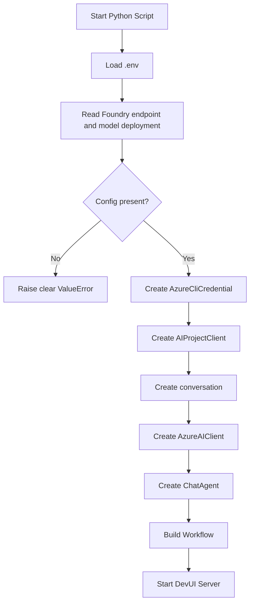
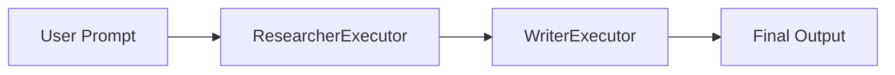
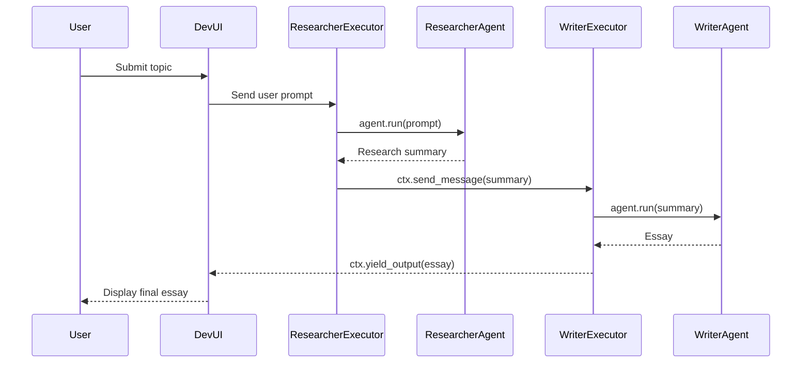
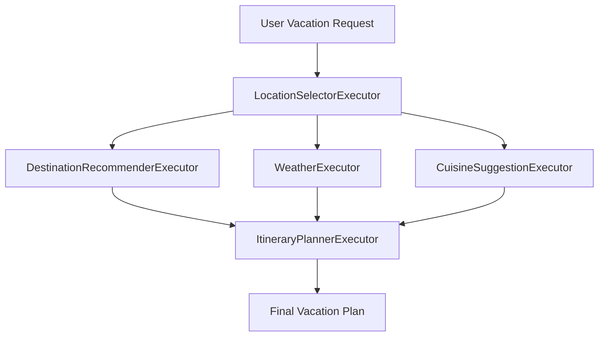
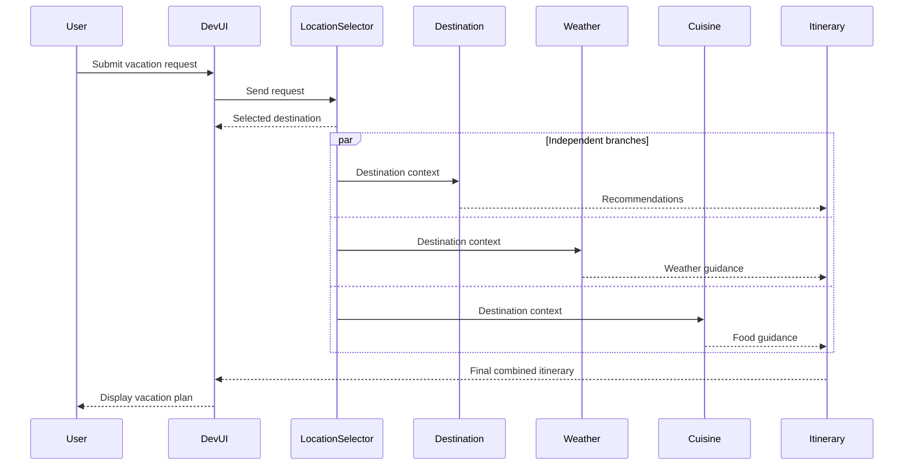

# Application Logic

This document explains how the two workflow scripts are wired, how data moves between agents, and what happens at runtime.

## High-Level Architecture

Both scripts use the same main building blocks:

| Component | Role |
| --- | --- |
| `.env` | Provides Azure AI Foundry endpoint and model deployment name. |
| `AzureCliCredential` | Authenticates using the active `az login` session. |
| `AIProjectClient` | Connects to the Azure AI Foundry project. |
| `AzureAIClient` | Creates model-backed chat agents. |
| `ChatAgent` | Runs an LLM-powered agent with a role-specific instruction. |
| `Executor` | Represents one workflow node. |
| `WorkflowContext` | Sends intermediate messages or yields final output. |
| `WorkflowBuilder` | Wires executors into a sequential, fan-out, or fan-in graph. |
| `serve` | Starts Agent Framework DevUI. |

## Shared Startup Flow

Both scripts follow this startup pattern:



The scripts support both naming styles for environment variables:

```python
project_endpoint = os.getenv("AI_FOUNDRY_PROJECT_ENDPOINT") or os.getenv("FOUNDRY_PROJECT_ENDPOINT")
model = os.getenv("AI_FOUNDRY_DEPLOYMENT_NAME") or os.getenv("MODEL_DEPLOYMENT_NAME")
```

This avoids the common failure where the Azure client receives `endpoint=None`.

## Sequential Workflow Logic

File:

```text
sequential-workflow-devui.py
```

The sequential workflow has two agents:

| Agent | Executor | Responsibility |
| --- | --- | --- |
| Researcher Agent | `ResearcherExecutor` | Researches the user topic and sends a concise summary. |
| Writer Agent | `WriterExecutor` | Converts the research into a short essay and returns final output. |

### Sequential Wiring Diagram



### Sequential Code Wiring

```python
workflow = (
    WorkflowBuilder(
        name="Sequential Research & Writing Workflow",
        description="A two-step workflow: research a topic, then write an essay."
    )
    .set_start_executor(researcher_executor)
    .add_edge(researcher_executor, writer_executor)
    .build()
)
```

### Sequential Runtime Flow



### Why This Is Sequential

The writer cannot start until the researcher finishes. The edge:

```python
.add_edge(researcher_executor, writer_executor)
```

creates strict step-by-step execution.

Use this workflow when the second task depends directly on the first task's output.

## Parallel Workflow Logic

File:

```text
parallel-workflow-devui.py
```

The parallel workflow has five agents:

| Agent | Executor | Responsibility |
| --- | --- | --- |
| Location Picker Agent | `LocationSelectorExecutor` | Chooses or confirms the vacation location. |
| Destination Recommender Agent | `DestinationRecommenderExecutor` | Suggests attractions, neighborhoods, and budget tips. |
| Weather Agent | `WeatherExecutor` | Provides weather and packing guidance. |
| Cuisine Suggestion Agent | `CuisineSuggestionExecutor` | Suggests local foods and dining ideas. |
| Itinerary Planner Agent | `ItineraryPlannerExecutor` | Combines all branch outputs into the final itinerary. |

### Parallel Wiring Diagram



### Parallel Code Wiring

```python
workflow = (
    WorkflowBuilder(
        name="Vacation Planner Workflow",
        description="Multi-agent workflow for vacation planning with recommendations and itinerary."
    )
    .set_start_executor(location_selector_executor)
    .add_fan_out_edges(location_selector_executor, [
        destination_recommender_executor,
        weather_executor,
        cuisine_suggestion_executor
    ])
    .add_fan_in_edges([
        destination_recommender_executor,
        weather_executor,
        cuisine_suggestion_executor
    ], itinerary_planner_executor)
    .build()
)
```

### Parallel Runtime Flow



### Why This Is Parallel

After the location is selected, three specialist agents can work independently:

- Destination recommendations do not need weather output.
- Weather guidance does not need cuisine output.
- Cuisine suggestions do not need destination tips.

The workflow uses fan-out to start those independent branches:

```python
.add_fan_out_edges(location_selector_executor, [
    destination_recommender_executor,
    weather_executor,
    cuisine_suggestion_executor
])
```

Then it uses fan-in to wait for all three branch outputs before final planning:

```python
.add_fan_in_edges([
    destination_recommender_executor,
    weather_executor,
    cuisine_suggestion_executor
], itinerary_planner_executor)
```

The itinerary planner receives a list of branch results:

```python
async def handle(self, results: list[str], ctx: WorkflowContext[str]) -> None:
    response = await run_agent_with_retry(self.agent, results, max_tokens=900)
    await ctx.yield_output(str(response))
```

## Message Passing

Executors use two main `WorkflowContext` methods:

| Method | Meaning |
| --- | --- |
| `ctx.send_message(...)` | Sends intermediate output to the next executor or branch. |
| `ctx.yield_output(...)` | Marks a value as the final workflow response. |

Example from the sequential researcher:

```python
response = await run_agent_with_retry(self.agent, query, max_tokens=700)
await ctx.send_message(str(response))
```

Example from the final writer:

```python
response = await run_agent_with_retry(self.agent, research_data, max_tokens=900)
await ctx.yield_output(str(response))
```

## Rate Limit Handling

Both scripts include a retry helper:

```python
async def run_agent_with_retry(agent: ChatAgent, message, *, max_tokens: int = 800):
```

It retries when Azure returns transient rate-limit style errors such as:

```text
429 Too Many Requests
rate_limit_exceeded
```

The retry delay grows gradually:

```python
delay = min(30, (2 ** attempt) + random.uniform(0.25, 1.25))
```

The parallel workflow also supports a delay before the final itinerary call:

```env
ITINERARY_DELAY_SECONDS=10
```

This is useful because the parallel workflow sends multiple model requests close together.

## DevUI Ports

Default ports:

| Workflow | Default Port |
| --- | --- |
| Sequential | `8090` |
| Parallel | `8091` |

Override sequential port:

```powershell
$env:DEVUI_SEQUENTIAL_PORT="8093"
python .\sequential-workflow-devui.py
```

Override parallel port:

```powershell
$env:DEVUI_PORT="8092"
python .\parallel-workflow-devui.py
```

## Choosing Sequential vs Parallel

Use sequential workflow when each step depends on the previous step:

```text
Research first, write second.
```

Use parallel workflow when multiple independent tasks can run from the same input and later be merged:

```text
Destination tips, weather, and cuisine can be generated independently, then combined.
```

## End-to-End Behavior Summary

Sequential:

```text
Input topic
-> Research summary
-> Essay
-> Final answer
```

Parallel:

```text
Vacation request
-> Selected location
-> Destination recommendations + weather guidance + cuisine ideas
-> Combined itinerary
-> Final answer
```

Together, the two scripts demonstrate the core difference between pipeline-style agent orchestration and fan-out/fan-in agent orchestration.
