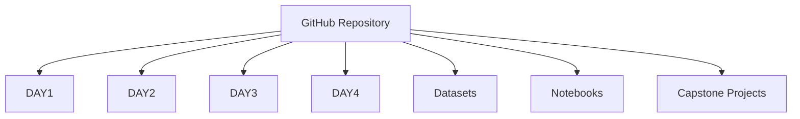
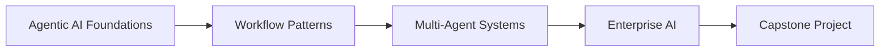
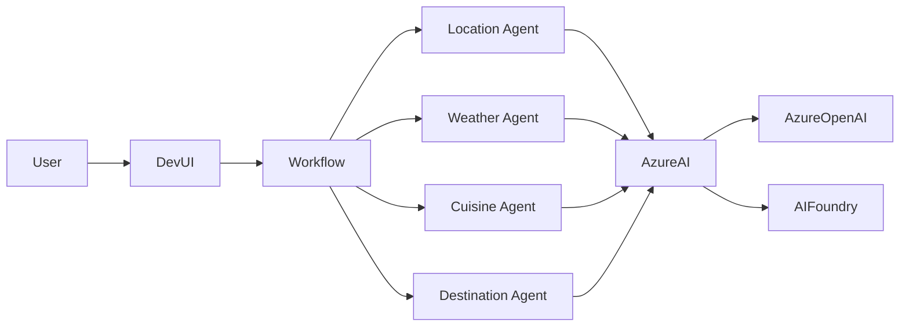
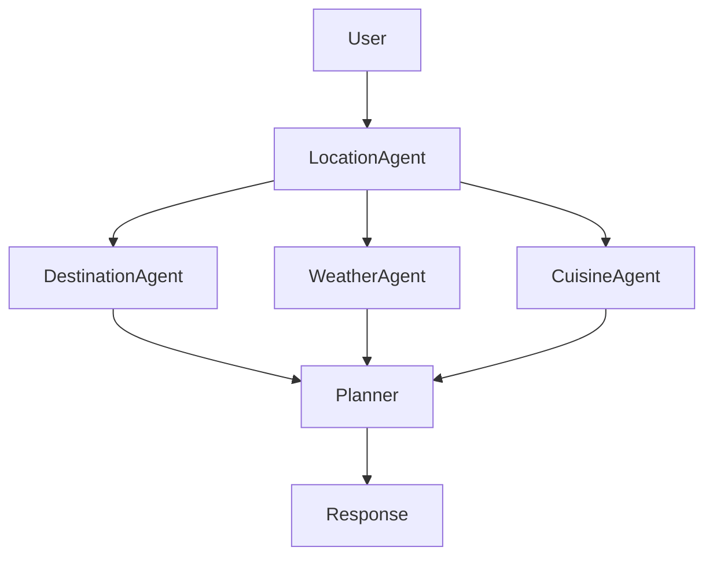
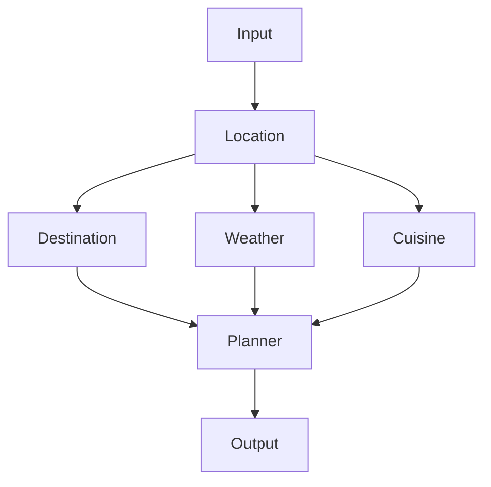
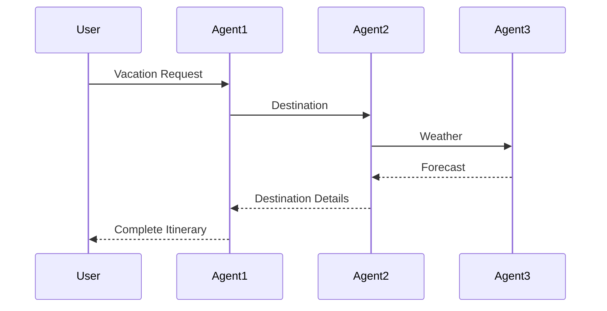

# 🚀 Agentic AI with Microsoft Agent Framework


---

# Overview

Welcome to the **Agentic AI with Microsoft Agent Framework** repository.

This repository contains complete hands-on labs, architecture patterns, notebooks, enterprise datasets, workflow samples, and capstone projects to build modern AI Agents using:

- Microsoft Agent Framework
- Azure AI Foundry
- Azure OpenAI
- Azure AI Search
- RAG
- Multi-Agent Systems
- DevUI

---

# Repository Structure

```
.
├── DAY1
├── DAY2
├── DAY3
├── DAY4
├── Datasets
├── NoteBooks
└── capstone-Projects
```

---

# Repository Wiring Diagram



---

# Course Learning Journey



---

# Enterprise Architecture



---

# Multi-Agent Workflow



---

# Parallel Workflow



---

# Sequential Workflow

```mermaid
flowchart LR

User

-->

Agent1

-->

Agent2

-->

Agent3

-->

Agent4

-->

Final Response
```

---

# RAG Architecture

```mermaid
flowchart LR

Documents

-->

Chunking

-->

Embeddings

-->

Vector Database

User

-->

Retriever

Retriever

-->

Vector Database

Vector Database

-->

Relevant Chunks

Relevant Chunks

-->

LLM

LLM

-->

Answer
```

---

# Agent-to-Agent Communication



---

# Azure AI Foundry Architecture

```mermaid
flowchart LR

User

-->

DevUI

-->

Microsoft Agent Framework

-->

Azure AI Foundry

Azure AI Foundry

-->

Azure OpenAI

Azure AI Foundry

-->

Azure AI Search

Azure AI Search

-->

Knowledge Base

Azure OpenAI

-->

Response
```

---

# DAY 1

## Agentic AI Foundations

Topics

- Agentic AI
- AI Agents
- Chatbots
- Azure AI Foundry
- Azure OpenAI
- DevUI
- First Agent
- Prompt Engineering

Files

- DAY-1-Agentic_Ai_Foundations___Setup.pdf

---

# DAY 2

## Workflow Patterns

Topics

- Sequential Workflow
- Parallel Workflow
- Fan-Out
- Fan-In
- Conditional Routing
- Orchestrator Pattern
- RAG

Files

- Architecture PDF
- Labs

---

# DAY 3

## Multi-Agent Systems

Topics

- Tool Calling
- Memory
- Reflection
- Agent Collaboration
- A2A Communication
- Planning Agents

---

# DAY 4

## Enterprise Agentic AI

Topics

- Azure AI Foundry
- Responsible AI
- Monitoring
- Evaluation
- Security
- Production Deployment

---

# Datasets

Included enterprise datasets

- HR Policies
- Employee Records
- IT Knowledge Base
- Security Policies
- Professional Etiquette

Used for

- RAG
- AI Search
- Vector Indexing
- Enterprise QA

---

# Notebooks

Includes

## A2A

- Client
- Server

## Workflow Labs

- Sequential
- Parallel
- Orchestrator

## Multi-Agent Labs

- Travel Planner
- HR Assistant
- IT Helpdesk

---

# Capstone Projects

Enterprise Projects

- Vacation Planner
- HR Assistant
- IT Helpdesk
- Enterprise Knowledge Assistant
- Multi-Agent Enterprise Assistant

---

# Prerequisites

- Python 3.11
- VS Code
- Git
- Azure Subscription
- Azure AI Foundry
- Azure OpenAI Deployment

---

# Environment Variables

```env
AI_FOUNDRY_PROJECT_ENDPOINT=

AI_FOUNDRY_DEPLOYMENT_NAME=

AZURE_TENANT_ID=
```

---

# Installation

```bash
git clone <repo>

cd Agentic-AI

pip install -r requirements.txt
```

---

# Run Notebook

```bash
jupyter notebook
```

---

# Run DevUI

```bash
python orchestrator-devui.py
```

or

```bash
python parallel-workflow.py
```

---

# Technologies

- Microsoft Agent Framework
- Azure AI Foundry
- Azure OpenAI
- Azure AI Search
- Python
- DevUI
- Jupyter
- Vector Search
- RAG

---

# Learning Outcomes

After completing this course you will be able to

✅ Build AI Agents

✅ Build Multi-Agent Systems

✅ Implement RAG

✅ Build Enterprise Workflows

✅ Develop Agentic AI Applications

✅ Deploy using Azure AI Foundry

---

# License

Educational & Corporate Training

© AVYUKTi Tech Private Limited
